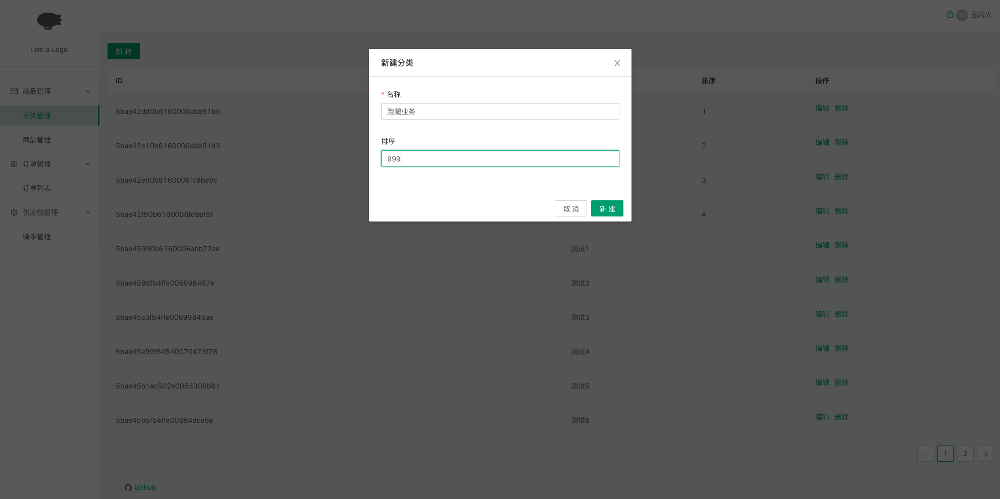
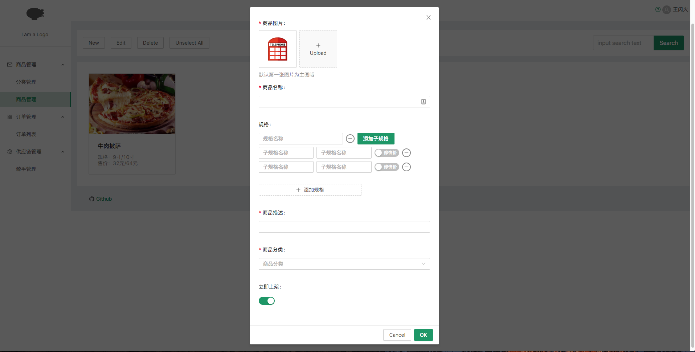

# A Next.js starter with TypeScript and AntDesign (base on Next.js 7)

# It's a simple Dashboard. Less is More.

## How to using

1. fork or clone or download
2. npm i
3. npm run dev

**replace LeanCloud API_KEY & APP_ID with yourself**

## What it looks like

