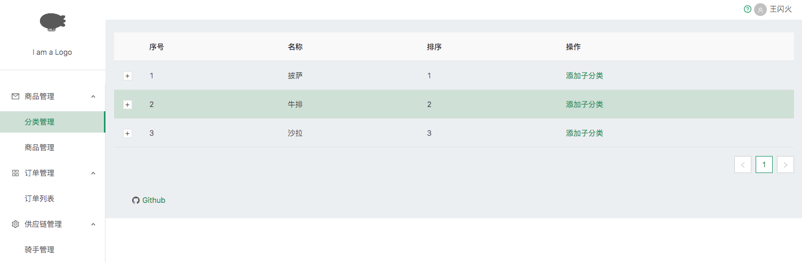

# A Next.js starter with TypeScript and AntDesign (base on Next.js 7)

# It's a simple Dashboard. Less is More.

## How to using

1. fork or clone or download
2. npm i
3. npm run dev

**replace LeanCloud API_KEY & APP_ID with yourself**

## What it looks like

## change logs
9. 9-28
    - finish category function
    - prepare design a HOC for functions like category does
8. 9-27
   - use [leancloud](https://leancloud.cn)
   - add some api support
   - add category manager
9. 9-20
   - support next.js 7
10. 9-19
    - add some page
11. 9-18
    - add menu model
12. 9-16
    - add redux and it's friends
    - add dva
    - use dva
    - writing templates
13. 9-12
    - add antd
14. 9-11 
    - add koa
    - add default _app,_document, _error
    - add some test layouts
15. 9-7
    - init nextjs repo
    - add ts,scss config
    - add axios and a simple wrapper
